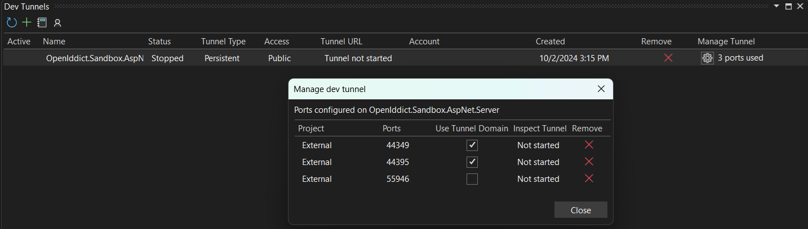
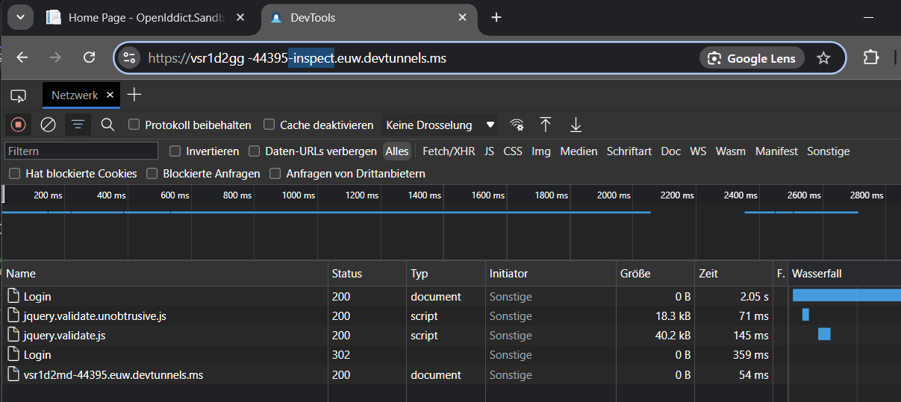

# Using dev tunnels <Badge type="warning" text="client" /><Badge type="danger" text="server" />

When you are developing an Asp.Net or Asp.Net Core based web application running on your developer machine, usually you can connect to the server using the pre configured `applicationUrl` (e.g https://localhost:44359)

If you are, however, integrating an Android or iOS application using MAUI or Avalonia, the app will run either on a physical device or on a local emulator/simulator. In either case using localhost is not an option.

Instead you can use [Microsoft dev tunnels](https://learn.microsoft.com/en-us/azure/developer/dev-tunnels/overview).

Both tools provide you with a URL that you can connect to. Any traffic received will be routed to your local web application.
In this guide we will guide you in using those tools.

::: info
In the case of Android, you can use the well known IP Address `10.0.2.2`. However, this is only mapped to `127.0.0.1`, so you will have to configure your server to listen to that host name too _and_ it only works on the emulator. 

Additionally, the `IssuerUrl` of your server would have to be changed to `127.0.0.1` too.
::: 


## Microsoft dev tunnels

Microsoft dev tunnels are available for [Visual Studio Code](https://code.visualstudio.com/docs/editor/port-forwarding) and [Visual Studio](https://learn.microsoft.com/en-us/aspnet/core/test/dev-tunnels?view=aspnetcore-8.0)

Explaining these tools in detail is outside the scope of this guide. Please refer to the following links to
- [create a dev tunnel in Visual Studio Code](https://code.visualstudio.com/docs/editor/port-forwarding)
- [create a dev tunnel in Visual Studio 2022](https://learn.microsoft.com/en-us/aspnet/core/test/dev-tunnels?view=aspnetcore-8.0)

### Configure the IssuerUrl

In order to use this tunnel now, you need to set the `IssuerUrl` 
- in the server project (e.g. `Startup.cs`)
```csharp
  services.AddOpenIddict()
      // Register the OpenIddict server components.
      .AddServer(options =>
      {
        options.SetIssuer(new Uri("https://vsr1d2gg-44359.euw.devtunnels.ms/", UriKind.Absolute));  // [!code ++]
        // ...
      });
```
- and on the client project (e.g. `MauiProgram.cs`)
```csharp
            // Register the OpenIddict client components.
            .AddClient(options =>
            {
                // ...

                // Add a client registration matching the client application definition in the server project.
                options.AddRegistration(new OpenIddictClientRegistration
                {
                    Issuer = new Uri("https://localhost:44395/", UriKind.Absolute), // [!code --]
                    Issuer = new Uri("https://vsr1d2gg-44359.euw.devtunnels.ms/", UriKind.Absolute), // [!code ++]
                    ProviderName = "Local",

                    ClientId = "maui",

                    // This sample uses protocol activations with a custom URI scheme to handle callbacks.
                    //
                    // For more information on how to construct private-use URI schemes,
                    // read https://www.rfc-editor.org/rfc/rfc8252#section-7.1 and
                    // https://www.rfc-editor.org/rfc/rfc7595#section-3.8.
                    PostLogoutRedirectUri = new Uri("com.openiddict.sandbox.maui.client:/callback/logout/local", UriKind.Absolute),
                    RedirectUri = new Uri("com.openiddict.sandbox.maui.client:/callback/login/local", UriKind.Absolute),

                    Scopes = { Scopes.Email, Scopes.Profile, Scopes.OfflineAccess, "demo_api" }
                });

                // ...

```


> [!WARNING] Use tunnel domain
>
> One pitfall with dev tunnels is, that they do not forward their domain name to the server but redirect traffic to `localhost`. This means, that even though you connect to your server using the dev tunnels URL (e.g. `https://vsr1d2gg-44359.euw.devtunnels.ms`), the request URL on your server will be `https://localhost:44359`. 
>
> This causes a variety of issues such as
> - some OpenIddict WebProviders not working since the cookies provided by them in order to keep necessary state are lost since they are created for the tunnel domain and thus not served to `localhost`
> - the OpenIddict client stack not being able to connect to your local server from a remote machine (e.g. Android emulator) since OpenId Connect Discovery fetches the `.well-known/openid-configuration` which will have all endpoints configured to `https://localhost:44359` instead of your dev tunnels URL.
>
> To fix this, you **must** check the _Use Tunnel Domain_ checkbox in the _Manage dev tunnel_ dialog 
> 

### Add binding for IIS Express 
When running your app in IIS Express, you will have edit the _applicationhost.config_ and add a binding for your dev tunnel.
Otherwise you will get an error message when trying to connect to your app via the tunnels URL.

For example, if your web application listens on `https://localhost:44359` locally and your tunnels URL is `https://vsr1d2gg-44359.euw.devtunnels.ms` you can either add an explicit binding for your URL
```xml{3}
    <bindings>
        <binding protocol="http" bindingInformation="*:55946:localhost" />
        <binding protocol="https" bindingInformation="*:44359:vsr1d2gg-44359.euw.devtunnels.ms" />
        <binding protocol="https" bindingInformation="*:44359:localhost" />
    </bindings>
```
or add a wildcard binding for that port
```xml{3}
    <bindings>
        <binding protocol="http" bindingInformation="*:55946:localhost" />
        <binding protocol="https" bindingInformation="*:44359:*" />
        <binding protocol="https" bindingInformation="*:44359:localhost" />
    </bindings>
```

### Inspect network traffic

In case you want to trace or inspect the network traffic of your dev tunnel, simply add `-inspect` after the host name of your URL.
For example, `https://vsr1d2gg-44359.euw.devtunnels.ms` is changed to `https://vsr1d2gg-44359-inspect.euw.devtunnels.ms`.
This will show a network tab similar to those of the browser developer tools:

